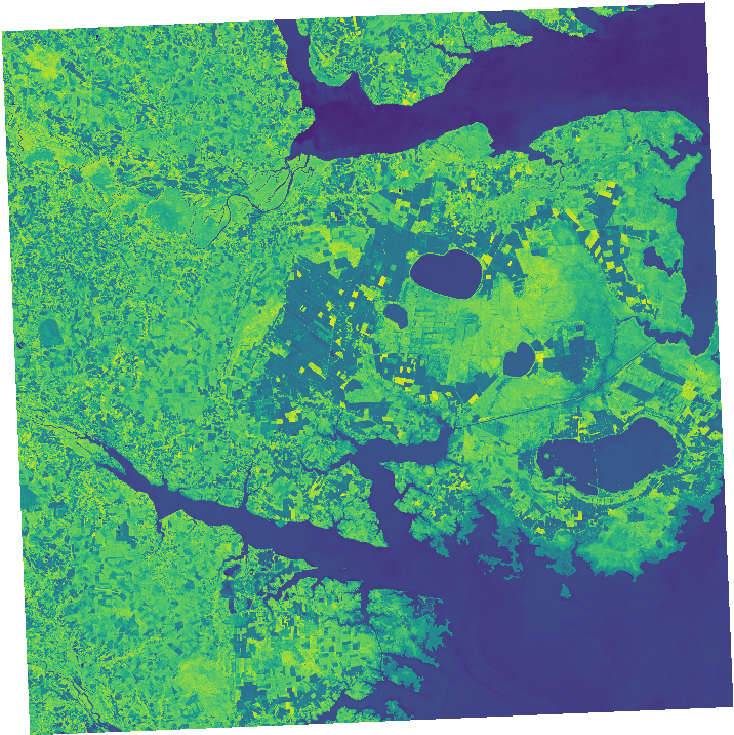

User defined processing
=======================

The actinia process chain
-------------------------

Actinia provides the **process chain** approach to specify import,
processing and export of geodata using the actinia GRASS GIS processing
system. The process chain must be formulated in JSON. The processing is
always performed in an ephemeral database. The computational environment
is based on locations in the persistent database. If required, the
ephemeral database can be moved into the persistent user database, so
that the computational results can be used in further processing steps
or visualized using the actinia rendering REST calls.

The ephemeral database will be removed after computation. However, all
raster and vector data that was generated during the processing can be
exported using gdal/ogr specific datatypes and stored in an object
storage, outside the actinia environment. Within a process chain we have
read only access to all raster maps of the persistent database location
that is used as computational environment.

A process chain is a list of GRASS GIS modules[^1] that will be executed in
serial, based on the order of the list. GRASS GIS modules are specified
as process definitions[^2] that include the name of the command, the
inputs and outputs], including import and export definitions as
well as the module flags.

The following example defines a single process
that runs the GRASS GIS module *r.slope.aspect*[^3] to compute the
*slope* for the raster map layer *elev\_ned\_30m* that is located in the
mapset[^4] *PERMANENT*. The output of the module is named
*elev\_ned\_30m\_slope* and should be exported as a GeoTiff file.

```json
 {
   "module": "r.slope.aspect",
   "id": "r_slope_aspect_1",
   "inputs": [
     {
       "param": "elevation",
       "value": "elev_ned_30m@PERMANENT"
     }
   ],
   "outputs": [
     {
       "export": {
         "format": "GTiff",
         "type": "raster"
       },
       "param": "slope",
       "value": "elev_ned_30m_slope"
     }
   ],
   "flags": "a"
 }
```

**Import and export**

The actinia process chain supports the specification of URL\'s to raster
layers in the input definition. The following process chain imports a
raster map layer that is located in an object storage with the name
*elev\_ned\_30m\_new* and sets the computational region for the
following processing step with the GRASS GIS module *g.region*[^5]. Then
slope and aspect are computed with *r.slope.aspect* and specified for
export as GeoTiff files.

```json
 {
   "list": [
     {
       "module": "g.region",
       "id": "g_region_1",
       "inputs": [
         {
           "import_descr": {
             "source": "https://storage.googleapis.com/graas-geodata/elev_ned_30m.tif",
             "type": "raster"
           },
           "param": "raster",
           "value": "elev_ned_30m_new"
         }
       ],
       "flags": "p"
     },
     {
       "module": "r.slope.aspect",
       "id": "r_slope_aspect_1",
       "inputs": [
         {
           "param": "elevation",
           "value": "elev_ned_30m_new"
         }
       ],
       "outputs": [
         {
           "export": {
             "format": "GTiff",
             "type": "raster"
           },
           "param": "slope",
           "value": "elev_ned_30m_new_slope"
         }
       ],
       "flags": "a"
     }
   ],
   "version": "1"
 }
```


**Output parsing**

Many GRASS GIS modules produce textual output in form of lists, tables
and key/value pairs. Actinia supports the analysis of this data and the
parsing and transformation in JSON accessible data. For each GRASS GIS
module the property \"stdout\" can be specified to transform the output
of the module into a list of values, a key/value list or a table.

The following options are available as format:

 -   \"kv\" parses the module output and creates key/value pairs
 -   \"list\" parses the module output and creates a list of values
 -   \"table\" parses the module output and creates a list of lists
     with values aka 2D array aka table

Additionally the unique id that will be used in the response process
result dictionary and the delimiter must be defined.

The following process chain demonstrates all available approaches, to
parse the stdout output of a module:

```json
 {
     "version": 1,
     "list": [
         {
             "id": "1",
             "module": "g.region",
             "inputs": [
                 {"param": "raster",
                  "value": "elevation@PERMANENT"},
                 {"param": "res",
                  "value": "5000"}
             ],
             "stdout": {"id": "region", "format": "kv", "delimiter": "="},
             "flags": "g"
         },
         {
             "id": "2",
             "module": "r.out.ascii",
             "inputs": [{"param": "input",
                         "value": "elevation@PERMANENT"},
                        {"param": "precision", "value": "0"}],
             "stdout": {"id": "elevation", "format": "table", "delimiter": " "},
             "flags": "h"
         },
         {
             "id": "3",
             "module": "g.list",
             "inputs": [{"param": "type",
                         "value": "raster"}],
             "stdout": {"id": "map_list", "format": "list", "delimiter": "\n"}
         },
         {
             "id": "4",
             "module": "r.univar",
             "inputs": [{"param": "map",
                         "value": "elevation@PERMANENT"}],
             "stdout": {"id": "stats", "format": "kv", "delimiter": "="},
             "flags": "g"
         },
         {
             "id": "5",
             "module": "r.univar",
             "inputs": [{"param": "map",
                         "value": "elevation@PERMANENT"},
                        {"param": "zones",
                         "value": "basin_50K@PERMANENT"},
                        {"param": "separator",
                         "value": "pipe"}],
             "stdout": {"id": "stats_zonal", "format": "table", "delimiter": "|"},
             "flags": "t"
         }
     ]
 }
```

The result of the process chain evaluation is the following JSON
response:

```json
 {
   "accept_datetime": "2018-06-28 14:11:03.439431",
   "accept_timestamp": 1530195063.439429,
   "api_info": {
     "endpoint": "asyncephemeralresource",
     "method": "POST",
     "path": "/api/v3/locations/nc_spm_08/processing_async",
     "request_url": "http://localhost/api/v3/locations/nc_spm_08/processing_async"
   },
   "datetime": "2018-06-28 14:11:03.878996",
   "http_code": 200,
   "message": "Processing successfully finished",
   "process_chain_list": [
     {
       "list": [
         {
           "flags": "g",
           "id": "1",
           "inputs": [
             {
               "param": "raster",
               "value": "elevation@PERMANENT"
             },
             {
               "param": "res",
               "value": "5000"
             }
           ],
           "module": "g.region",
           "stdout": {
             "delimiter": "=",
             "format": "kv",
             "id": "region"
           }
         },
         {
           "flags": "h",
           "id": "2",
           "inputs": [
             {
               "param": "input",
               "value": "elevation@PERMANENT"
             },
             {
               "param": "precision",
               "value": "0"
             }
           ],
           "module": "r.out.ascii",
           "stdout": {
             "delimiter": " ",
             "format": "table",
             "id": "elevation"
           }
         },
         {
           "id": "3",
           "inputs": [
             {
               "param": "type",
               "value": "raster"
             }
           ],
           "module": "g.list",
           "stdout": {
             "delimiter": "\n",
             "format": "list",
             "id": "map_list"
           }
         },
         {
           "flags": "g",
           "id": "4",
           "inputs": [
             {
               "param": "map",
               "value": "elevation@PERMANENT"
             }
           ],
           "module": "r.univar",
           "stdout": {
             "delimiter": "=",
             "format": "kv",
             "id": "stats"
           }
         },
         {
           "flags": "t",
           "id": "5",
           "inputs": [
             {
               "param": "map",
               "value": "elevation@PERMANENT"
             },
             {
               "param": "zones",
               "value": "basin_50K@PERMANENT"
             },
             {
               "param": "separator",
               "value": "pipe"
             }
           ],
           "module": "r.univar",
           "stdout": {
             "delimiter": "|",
             "format": "table",
             "id": "stats_zonal"
           }
         }
       ],
       "version": 1
     }
   ],
   "process_log": [
     {
       "executable": "g.region",
       "parameter": [
         "raster=elevation@PERMANENT",
         "res=5000",
         "-g"
       ],
       "return_code": 0,
       "run_time": 0.050546884536743164,
       "stderr": [
         ""
       ],
       "stdout": "projection=99\nzone=0\nn=228500\ns=215000\nw=630000\ne=645000\nnsres=4500\newres=5000\nrows=3\ncols=3\ncells=9\n"
     },
     {
       "executable": "r.out.ascii",
       "parameter": [
         "input=elevation@PERMANENT",
         "precision=0",
         "-h"
       ],
       "return_code": 0,
       "run_time": 0.05101513862609863,
       "stderr": [
         "0..33..66.."
       ],
       "stdout": "147 138 100 \n125 114 76 \n125 121 96 \n"
     },
     {
       "executable": "g.list",
       "parameter": [
         "type=raster"
       ],
       "return_code": 0,
       "run_time": 0.05074191093444824,
       "stderr": [
         ""
       ],
       "stdout": "aspect\nbasin_50K\nboundary_county_500m\ncfactorbare_1m\ncfactorgrow_1m\nel_D782_6m\nel_D783_6m\nel_D792_6m\nel_D793_6m\nelev_lid792_1m\nelev_ned_30m\nelev_srtm_30m\nelev_state_500m\nelevation\nelevation_shade\nfacility\ngeology_30m\nlakes\nlandclass96\nlandcover_1m\nlanduse96_28m\nlsat7_2002_10\nlsat7_2002_20\nlsat7_2002_30\nlsat7_2002_40\nlsat7_2002_50\nlsat7_2002_61\nlsat7_2002_62\nlsat7_2002_70\nlsat7_2002_80\nncmask_500m\northo_2001_t792_1m\nroadsmajor\nslope\nsoilsID\nsoils_Kfactor\nstreams_derived\ntowns\nurban\nzipcodes\nzipcodes_dbl\n"
     },
     {
       "executable": "r.univar",
       "parameter": [
         "map=elevation@PERMANENT",
         "-g"
       ],
       "return_code": 0,
       "run_time": 0.05033302307128906,
       "stderr": [
         ""
       ],
       "stdout": "n=9\nnull_cells=0\ncells=9\nmin=75.9926223754883\nmax=147.101608276367\nrange=71.1089859008789\nmean=115.709356519911\nmean_of_abs=115.709356519911\nstddev=20.8179625939249\nvariance=433.387566562055\ncoeff_var=17.9915982769661\nsum=1041.3842086792\n"
     },
     {
       "executable": "r.univar",
       "parameter": [
         "map=elevation@PERMANENT",
         "zones=basin_50K@PERMANENT",
         "separator=pipe",
         "-t"
       ],
       "return_code": 0,
       "run_time": 0.05089259147644043,
       "stderr": [
         "0..33..66..100",
         ""
       ],
       "stdout": "zone|label|non_null_cells|null_cells|min|max|range|mean|mean_of_abs|stddev|variance|coeff_var|sum|sum_abs\n2||1|0|99.7889709472656|99.7889709472656|0|99.7889709472656|99.7889709472656|0|0|0|99.7889709472656|99.7889709472656\n8||1|0|137.68424987793|137.68424987793|0|137.68424987793|137.68424987793|0|0|0|137.68424987793|137.68424987793\n14||1|0|114.471084594727|114.471084594727|0|114.471084594727|114.471084594727|0|0|0|114.471084594727|114.471084594727\n16||1|0|75.9926223754883|75.9926223754883|0|75.9926223754883|75.9926223754883|0|0|0|75.9926223754883|75.9926223754883\n20||2|0|124.611175537109|125.171577453613|0.560401916503906|124.891376495361|124.891376495361|0.280200958251953|0.0785125770053128|0.224355729046161|249.782752990723|249.782752990723\n24||1|0|120.942115783691|120.942115783691|0|120.942115783691|120.942115783691|0|0|0|120.942115783691|120.942115783691\n"
     }
   ],
   "process_results": {
     "elevation": [
       [
         "147",
         "138",
         "100"
       ],
       [
         "125",
         "114",
         "76"
       ],
       [
         "125",
         "121",
         "96"
       ]
     ],
     "map_list": [
       "aspect",
       "basin_50K",
       "boundary_county_500m",
       "cfactorbare_1m",
       "cfactorgrow_1m",
       "el_D782_6m",
       "el_D783_6m",
       "el_D792_6m",
       "el_D793_6m",
       "elev_lid792_1m",
       "elev_ned_30m",
       "elev_srtm_30m",
       "elev_state_500m",
       "elevation",
       "elevation_shade",
       "facility",
       "geology_30m",
       "lakes",
       "landclass96",
       "landcover_1m",
       "landuse96_28m",
       "lsat7_2002_10",
       "lsat7_2002_20",
       "lsat7_2002_30",
       "lsat7_2002_40",
       "lsat7_2002_50",
       "lsat7_2002_61",
       "lsat7_2002_62",
       "lsat7_2002_70",
       "lsat7_2002_80",
       "ncmask_500m",
       "ortho_2001_t792_1m",
       "roadsmajor",
       "slope",
       "soilsID",
       "soils_Kfactor",
       "streams_derived",
       "towns",
       "urban",
       "zipcodes",
       "zipcodes_dbl"
     ],
     "region": {
       "cells": "9",
       "cols": "3",
       "e": "645000",
       "ewres": "5000",
       "n": "228500",
       "nsres": "4500",
       "projection": "99",
       "rows": "3",
       "s": "215000",
       "w": "630000",
       "zone": "0"
     },
     "stats": {
       "cells": "9",
       "coeff_var": "17.9915982769661",
       "max": "147.101608276367",
       "mean": "115.709356519911",
       "mean_of_abs": "115.709356519911",
       "min": "75.9926223754883",
       "n": "9",
       "null_cells": "0",
       "range": "71.1089859008789",
       "stddev": "20.8179625939249",
       "sum": "1041.3842086792",
       "variance": "433.387566562055"
     },
     "stats_zonal": [
       [
         "zone",
         "label",
         "non_null_cells",
         "null_cells",
         "min",
         "max",
         "range",
         "mean",
         "mean_of_abs",
         "stddev",
         "variance",
         "coeff_var",
         "sum",
         "sum_abs"
       ],
       [
         "2",
         "",
         "1",
         "0",
         "99.7889709472656",
         "99.7889709472656",
         "0",
         "99.7889709472656",
         "99.7889709472656",
         "0",
         "0",
         "0",
         "99.7889709472656",
         "99.7889709472656"
       ],
       [
         "8",
         "",
         "1",
         "0",
         "137.68424987793",
         "137.68424987793",
         "0",
         "137.68424987793",
         "137.68424987793",
         "0",
         "0",
         "0",
         "137.68424987793",
         "137.68424987793"
       ],
       [
         "14",
         "",
         "1",
         "0",
         "114.471084594727",
         "114.471084594727",
         "0",
         "114.471084594727",
         "114.471084594727",
         "0",
         "0",
         "0",
         "114.471084594727",
         "114.471084594727"
       ],
       [
         "16",
         "",
         "1",
         "0",
         "75.9926223754883",
         "75.9926223754883",
         "0",
         "75.9926223754883",
         "75.9926223754883",
         "0",
         "0",
         "0",
         "75.9926223754883",
         "75.9926223754883"
       ],
       [
         "20",
         "",
         "2",
         "0",
         "124.611175537109",
         "125.171577453613",
         "0.560401916503906",
         "124.891376495361",
         "124.891376495361",
         "0.280200958251953",
         "0.0785125770053128",
         "0.224355729046161",
         "249.782752990723",
         "249.782752990723"
       ],
       [
         "24",
         "",
         "1",
         "0",
         "120.942115783691",
         "120.942115783691",
         "0",
         "120.942115783691",
         "120.942115783691",
         "0",
         "0",
         "0",
         "120.942115783691",
         "120.942115783691"
       ]
     ]
   },
   "progress": {
     "num_of_steps": 5,
     "step": 5
   },
   "resource_id": "resource_id-f084adb6-53eb-42eb-abd1-ae2799a53561",
   "status": "finished",
   "time_delta": 0.4396040439605713,
   "timestamp": 1530195063.878975,
   "urls": {
     "resources": [],
     "status": "http://localhost/api/v3/resources/admin/resource_id-f084adb6-53eb-42eb-abd1-ae2799a53561"
   },
   "user_id": "admin"
 }
```

The result of the stdout output parsing for each module is located in
the \"process\_results\" section of the json response.

Sentinel-2A NDVI process chain
--

We will use the Unix shell and curl to access the REST API. First open a shell of choice (we use bash here) and setup the login information, the  IP address and the port on which the actinia service is running, so you can simply change the IP and port if your server uses a different
address:

```bash
export ACTINIA_URL=https://actinia.mundialis.de/latest
export AUTH='-u demouser:gu3st!pa55w0rd'
# other user credentials can be provided in the same way
```
We create a process chain that computes the NDVI from a Sentinel-2A
scene based on the bands 8 and 4 with the GRASS GIS module *r.mapcalc*. We
use the North Carolina sample location **nc\_spm\_08** as processing
environment and the computational region of sentinel band B04 for the
NDVI processing. Then we calculate univariate statistics for the
Sentinel-2A scene. The computed NDVI raster layer will be exported as
geotiff file that can be accessed via an URL.

The following JSON code has 6 process definitions:

 1.  Import of two bands (B04 and B08) of the Sentinel-2A scene
     *S2A\_MSIL2A\_20220420T154941\_N0400\_R054\_T18SUE\_20220421T000632*
 2.  Set the computational region to imported raster layer B04
 3.  Use *r.mapcalc* to compute the NDVI
 4.  Use *r.univar* to compute univariate statistics of the computed NDVI
     raster layer
 5.  Export the computed NDVI as GeoTiff

```json
 {
  "list": [{"id": "importer_1",
           "module": "importer",
           "inputs": [{"import_descr": {"source": "S2A_MSIL2A_20220420T154941_N0400_R054_T18SUE_20220421T000632",
                                        "type": "sentinel2",
                                        "sentinel_band": "B04"},
                       "param": "map",
                       "value": "B04"},
                      {"import_descr": {"source": "S2A_MSIL2A_20220420T154941_N0400_R054_T18SUE_20220421T000632",
                                        "type": "sentinel2",
                                        "sentinel_band": "B08"},
                       "param": "map",
                       "value": "B08"}]},
          {"id": "g_region_1",
           "module": "g.region",
           "inputs": [{"param": "raster",
                       "value": "B04"}],
           "flags": "g"},
          {"id": "rmapcalc_1",
           "module": "r.mapcalc",
           "inputs": [{"param": "expression",
                       "value": "NDVI = float(B08 - B04)/(B08 + B04)"}]},
          {"id": "r_univar_sentinel2",
           "module": "r.univar",
           "inputs": [{"param": "map",
                       "value": "NDVI"}],
           "flags": "g"},
          {"id": "exporter_1",
           "module": "exporter",
           "outputs": [{"export": {"type": "raster", "format": "GTiff"},
                        "param": "map",
                        "value": "NDVI"}]}
          ],
  "version": "1"
 }
```

Run the process chain asynchronously:

```bash
 JSON='{
 "list": [{"id": "importer_1",
           "module": "importer",
           "inputs": [{"import_descr": {"source": "S2A_MSIL2A_20220420T154941_N0400_R054_T18SUE_20220421T000632",
                                        "type": "sentinel2",
                                        "sentinel_band": "B04"},
                       "param": "map",
                       "value": "B04"},
                      {"import_descr": {"source": "S2A_MSIL2A_20220420T154941_N0400_R054_T18SUE_20220421T000632",
                                        "type": "sentinel2",
                                        "sentinel_band": "B08"},
                       "param": "map",
                       "value": "B08"}]},
          {"id": "g_region_1",
           "module": "g.region",
           "inputs": [{"param": "raster",
                       "value": "B04"}],
           "flags": "g"},
          {"id": "rmapcalc_1",
           "module": "r.mapcalc",
           "inputs": [{"param": "expression",
                       "value": "NDVI = float(B08 - B04)/(B08 + B04)"}]},
          {"id": "r_univar_sentinel2",
           "module": "r.univar",
           "inputs": [{"param": "map",
                       "value": "NDVI"}],
           "flags": "g"},
          {"id": "exporter_1",
           "module": "exporter",
           "outputs": [{"export": {"type": "raster", "format": "GTiff"},
                        "param": "map",
                        "value": "NDVI"}]}
          ],
 "version": "1"}'

curl ${AUTH} -X POST "${ACTINIA_URL}/locations/nc_spm_08/processing_async_export" -H "accept: application/json" -H "content-type: application/json" -d "$JSON"
```

The response requires the polling of the status URL, since the API call
works asynchronously:

```json
{
  "accept_datetime": "2022-07-28 14:07:21.578233",
  "accept_timestamp": 1659017241.5782313,
  "api_info": {
    "endpoint": "asyncephemeralexportresource",
    "method": "POST",
    "path": "/api/v3/locations/nc_spm_08/processing_async_export",
    "request_url": "http://actinia.mundialis.de/api/v3/locations/nc_spm_08/processing_async_export"
  },
  "datetime": "2022-07-28 14:07:21.580321",
  "http_code": 200,
  "message": "Resource accepted",
  "process_chain_list": [],
  "process_results": {},
  "resource_id": "resource_id-b7b3bfb6-5887-4bc7-b80d-54c0424bfd70",
  "status": "accepted",
  "time_delta": 0.002097606658935547,
  "timestamp": 1659017241.58032,
  "urls": {
    "resources": [],
    "status": "https://actinia.mundialis.de/api/v3/resources/demouser/resource_id-b7b3bfb6-5887-4bc7-b80d-54c0424bfd70"
  },
  "user_id": "demouser"
}

```

Poll the status of the Sentinel-2A NDVI job and view the result of the
computation (remember to use your own resource-id):

```bash
 curl ${AUTH} -X GET "${ACTINIA_URL}/resources/demouser/resource_id-b7b3bfb6-5887-4bc7-b80d-54c0424bfd70"
```

The finished response should look like this:

```json
{
  "accept_datetime": "2022-07-28 14:07:21.578233",
  "accept_timestamp": 1659017241.5782313,
  "api_info": {
    "endpoint": "asyncephemeralexportresource",
    "method": "POST",
    "path": "/api/v3/locations/nc_spm_08/processing_async_export",
    "request_url": "http://actinia.mundialis.de/api/v3/locations/nc_spm_08/processing_async_export"
  },
  "datetime": "2022-07-28 14:14:42.004376",
  "http_code": 200,
  "message": "Processing successfully finished",
  "process_chain_list": [
    {
      "list": [
        {
          "id": "importer_1",
          "inputs": [
            {
              "import_descr": {
                "sentinel_band": "B04",
                "source": "S2A_MSIL2A_20220420T154941_N0400_R054_T18SUE_20220421T000632",
                "type": "sentinel2"
              },
              "param": "map",
              "value": "B04"
            },
            {
              "import_descr": {
                "sentinel_band": "B08",
                "source": "S2A_MSIL2A_20220420T154941_N0400_R054_T18SUE_20220421T000632",
                "type": "sentinel2"
              },
              "param": "map",
              "value": "B08"
            }
          ],
          "module": "importer"
        },
        {
          "flags": "g",
          "id": "g_region_1",
          "inputs": [
            {
              "param": "raster",
              "value": "B04"
            }
          ],
          "module": "g.region"
        },
        {
          "id": "rmapcalc_1",
          "inputs": [
            {
              "param": "expression",
              "value": "NDVI = float((B08 - B04))/(B08 + B04)"
            }
          ],
          "module": "r.mapcalc"
        },
        {
          "flags": "g",
          "id": "r_univar_sentinel2",
          "inputs": [
            {
              "param": "map",
              "value": "NDVI"
            }
          ],
          "module": "r.univar"
        },
        {
          "id": "exporter_1",
          "module": "exporter",
          "outputs": [
            {
              "export": {
                "format": "GTiff",
                "type": "raster"
              },
              "param": "map",
              "value": "NDVI"
            }
          ]
        }
      ],
      "version": "1"
    }
  ],
  "process_log": [
    {
      "executable": "i.sentinel.download",
      "id": "i_sentinel_download_S2A_MSIL2A_20220420T154941_N0400_R054_T18SUE_20220421T000632",
      "mapset_size": 421,
      "parameter": [
        "datasource=GCS",
        "query=identifier=S2A_MSIL2A_20220420T154941_N0400_R054_T18SUE_20220421T000632",
        "output=/actinia_core/workspace/temp_db/gisdbase_dbbd7bc372e942d0953fa0f7d019cacb/.tmp/temp_file_1"
      ],
      "return_code": 0,
      "run_time": 36.222164154052734,
      "stderr": [
        "Downloading data into </actinia_core/workspace/temp_db/gisdbase_dbbd7bc372e942d0953fa0f7d019cacb/.tmp/temp_file_1>...",
        "Downloading S2A_MSIL2A_20220420T154941_N0400_R054_T18SUE_20220421T000632...",
        "\r  0%|          | 0/84 [00:00<?, ?it/s]\r  2%|▏         | 2/84 [00:00<00:09,  8.82it/s]\r  4%|▎         | 3/84 [00:00<00:23,  3.38it/s]\r  5%|▍         | 4/84 [00:00<00:17,  4.45it/s]\r  7%|▋         | 6/84 [00:01<00:12,  6.48it/s]\r 10%|▉         | 8/84 [00:01<00:10,  7.02it/s]\r 11%|█         | 9/84 [00:01<00:10,  7.02it/s]\r 13%|█▎        | 11/84 [00:01<00:11,  6.62it/s]\r 14%|█▍        | 12/84 [00:04<00:46,  1.55it/s]\r 15%|█▌        | 13/84 [00:06<01:10,  1.01it/s]\r 17%|█▋        | 14/84 [00:09<01:45,  1.51s/it]\r 18%|█▊        | 15/84 [00:11<02:00,  1.75s/it]\r 19%|█▉        | 16/84 [00:14<02:18,  2.04s/it]\r 20%|██        | 17/84 [00:15<02:04,  1.85s/it]\r 21%|██▏       | 18/84 [00:16<01:30,  1.37s/it]\r 23%|██▎       | 19/84 [00:16<01:13,  1.13s/it]\r 24%|██▍       | 20/84 [00:17<01:07,  1.05s/it]\r 25%|██▌       | 21/84 [00:18<01:02,  1.01it/s]\r 26%|██▌       | 22/84 [00:19<00:58,  1.06it/s]\r 27%|██▋       | 23/84 [00:20<00:59,  1.02it/s]\r 29%|██▊       | 24/84 [00:21<00:57,  1.03it/s]\r 30%|██▉       | 25/84 [00:21<00:53,  1.10it/s]\r 31%|███       | 26/84 [00:22<00:50,  1.14it/s]\r 32%|███▏      | 27/84 [00:23<00:48,  1.18it/s]\r 33%|███▎      | 28/84 [00:24<00:48,  1.16it/s]\r 35%|███▍      | 29/84 [00:24<00:35,  1.53it/s]\r 36%|███▌      | 30/84 [00:26<00:50,  1.08it/s]\r 37%|███▋      | 31/84 [00:26<00:45,  1.18it/s]\r 38%|███▊      | 32/84 [00:26<00:32,  1.59it/s]\r 39%|███▉      | 33/84 [00:27<00:26,  1.90it/s]\r 40%|████      | 34/84 [00:27<00:21,  2.34it/s]\r 42%|████▏     | 35/84 [00:27<00:17,  2.81it/s]\r 43%|████▎     | 36/84 [00:27<00:16,  2.89it/s]\r 44%|████▍     | 37/84 [00:28<00:14,  3.32it/s]\r 45%|████▌     | 38/84 [00:28<00:12,  3.73it/s]\r 46%|████▋     | 39/84 [00:28<00:11,  4.07it/s]\r 48%|████▊     | 40/84 [00:28<00:10,  4.36it/s]\r 49%|████▉     | 41/84 [00:29<00:13,  3.25it/s]\r 50%|█████     | 42/84 [00:29<00:12,  3.48it/s]\r 51%|█████     | 43/84 [00:29<00:11,  3.50it/s]\r 52%|█████▏    | 44/84 [00:29<00:10,  3.94it/s]\r 54%|█████▎    | 45/84 [00:30<00:10,  3.56it/s]\r 55%|█████▍    | 46/84 [00:30<00:09,  3.85it/s]\r 56%|█████▌    | 47/84 [00:30<00:07,  4.65it/s]\r 58%|█████▊    | 49/84 [00:30<00:05,  6.73it/s]\r 61%|██████    | 51/84 [00:30<00:03,  8.87it/s]\r 63%|██████▎   | 53/84 [00:30<00:03,  9.97it/s]\r 65%|██████▌   | 55/84 [00:31<00:02, 10.87it/s]\r 68%|██████▊   | 57/84 [00:31<00:02, 11.09it/s]\r 70%|███████   | 59/84 [00:31<00:02, 10.17it/s]\r 73%|███████▎  | 61/84 [00:31<00:02, 11.35it/s]\r 75%|███████▌  | 63/84 [00:31<00:01, 11.71it/s]\r 77%|███████▋  | 65/84 [00:31<00:01, 10.88it/s]\r 80%|███████▉  | 67/84 [00:32<00:01,  9.74it/s]\r 82%|████████▏ | 69/84 [00:32<00:01,  8.64it/s]\r 83%|████████▎ | 70/84 [00:32<00:01,  8.45it/s]\r 86%|████████▌ | 72/84 [00:32<00:01,  8.65it/s]\r 88%|████████▊ | 74/84 [00:33<00:01,  9.05it/s]\r 90%|█████████ | 76/84 [00:33<00:00,  9.42it/s]\r 93%|█████████▎| 78/84 [00:33<00:00, 10.36it/s]\r 95%|█████████▌| 80/84 [00:33<00:00, 10.41it/s]\r 98%|█████████▊| 82/84 [00:33<00:00, 10.83it/s]\r100%|██████████| 84/84 [00:34<00:00,  4.78it/s]\r100%|██████████| 84/84 [00:34<00:00,  2.42it/s]",
        "Downloaded to /actinia_core/workspace/temp_db/gisdbase_dbbd7bc372e942d0953fa0f7d019cacb/.tmp/temp_file_1/S2A_MSIL2A_20220420T154941_N0400_R054_T18SUE_20220421T000632.SAFE",
        ""
      ],
      "stdout": ""
    },
    {
      "executable": "i.sentinel.import",
      "id": "i_sentinel_import_S2A_MSIL2A_20220420T154941_N0400_R054_T18SUE_20220421T000632",
      "mapset_size": 376982877,
      "parameter": [
        "input=/actinia_core/workspace/temp_db/gisdbase_dbbd7bc372e942d0953fa0f7d019cacb/.tmp/temp_file_1",
        "pattern=(B04_10m|B08_10m)",
        "-r"
      ],
      "return_code": 0,
      "run_time": 344.0564560890198,
      "stderr": [
        "Processing <T18SUE_20220420T154941_B08_10m>...",
        "Importing raster map <T18SUE_20220420T154941_B08_10m>...",
        "0..3..6..9..12..15..18..21..24..27..30..33..36..39..42..45..48..51..54..57..60..63..66..69..72..75..78..81..84..87..90..93..96..99..100",
        "Estimated target resolution for input band <T18SUE_20220420T154941_B08_10m>: 9.618686330457596",
        "Using given resolution for input band <T18SUE_20220420T154941_B08_10m>: 10.0",
        "Reprojecting <T18SUE_20220420T154941_B08_10m>...",
        "Rounding to integer after reprojection",
        "Processing <T18SUE_20220420T154941_B04_10m>...",
        "Importing raster map <T18SUE_20220420T154941_B04_10m>...",
        "0..3..6..9..12..15..18..21..24..27..30..33..36..39..42..45..48..51..54..57..60..63..66..69..72..75..78..81..84..87..90..93..96..99..100",
        "Estimated target resolution for input band <T18SUE_20220420T154941_B04_10m>: 9.618686330457596",
        "Using given resolution for input band <T18SUE_20220420T154941_B04_10m>: 10.0",
        "Reprojecting <T18SUE_20220420T154941_B04_10m>...",
        "Rounding to integer after reprojection",
        "Writing metadata to maps...",
        "/usr/local/grass/scripts/i.sentinel.import:830: DeprecationWarning: `np.float` is a deprecated alias for the builtin `float`. To silence this warning, use `float` by itself. Doing this will not modify any behavior and is safe. If you specifically wanted the numpy scalar type, use `np.float64` here.",
        "Deprecated in NumPy 1.20; for more details and guidance: https://numpy.org/devdocs/release/1.20.0-notes.html#deprecations",
        "  dtype=np.float,",
        "/usr/local/grass/scripts/i.sentinel.import:834: DeprecationWarning: `np.float` is a deprecated alias for the builtin `float`. To silence this warning, use `float` by itself. Doing this will not modify any behavior and is safe. If you specifically wanted the numpy scalar type, use `np.float64` here.",
        "Deprecated in NumPy 1.20; for more details and guidance: https://numpy.org/devdocs/release/1.20.0-notes.html#deprecations",
        "  dtype=np.float,",
        "/usr/local/grass/scripts/i.sentinel.import:846: DeprecationWarning: `np.float` is a deprecated alias for the builtin `float`. To silence this warning, use `float` by itself. Doing this will not modify any behavior and is safe. If you specifically wanted the numpy scalar type, use `np.float64` here.",
        "Deprecated in NumPy 1.20; for more details and guidance: https://numpy.org/devdocs/release/1.20.0-notes.html#deprecations",
        "  dtype=np.float,",
        "/usr/local/grass/scripts/i.sentinel.import:850: DeprecationWarning: `np.float` is a deprecated alias for the builtin `float`. To silence this warning, use `float` by itself. Doing this will not modify any behavior and is safe. If you specifically wanted the numpy scalar type, use `np.float64` here.",
        "Deprecated in NumPy 1.20; for more details and guidance: https://numpy.org/devdocs/release/1.20.0-notes.html#deprecations",
        "  dtype=np.float,",
        ""
      ],
      "stdout": ""
    },
    {
      "executable": "g.rename",
      "id": "rename_S2A_MSIL2A_20220420T154941_N0400_R054_T18SUE_20220421T000632_B04",
      "mapset_size": 376982877,
      "parameter": [
        "raster=T18SUE_20220420T154941_B04_10m,B04"
      ],
      "return_code": 0,
      "run_time": 0.15042471885681152,
      "stderr": [
        "Rename raster <T18SUE_20220420T154941_B04_10m> to <B04>",
        ""
      ],
      "stdout": ""
    },
    {
      "executable": "g.rename",
      "id": "rename_S2A_MSIL2A_20220420T154941_N0400_R054_T18SUE_20220421T000632_B08",
      "mapset_size": 376982877,
      "parameter": [
        "raster=T18SUE_20220420T154941_B08_10m,B08"
      ],
      "return_code": 0,
      "run_time": 0.15053868293762207,
      "stderr": [
        "Rename raster <T18SUE_20220420T154941_B08_10m> to <B08>",
        ""
      ],
      "stdout": ""
    },
    {
      "executable": "g.region",
      "id": "g_region_1",
      "mapset_size": 376982871,
      "parameter": [
        "raster=B04",
        "-g"
      ],
      "return_code": 0,
      "run_time": 0.10027408599853516,
      "stderr": [
        ""
      ],
      "stdout": "projection=99\nzone=0\nn=269280\ns=155130\nw=769610\ne=883770\nnsres=10\newres=10\nrows=11415\ncols=11416\ncells=130313640\n"
    },
    {
      "executable": "r.mapcalc",
      "id": "rmapcalc_1",
      "mapset_size": 808176157,
      "parameter": [
        "expression=NDVI = float((B08 - B04))/(B08 + B04)"
      ],
      "return_code": 0,
      "run_time": 25.457623958587646,
      "stderr": [
        ""
      ],
      "stdout": ""
    },
    {
      "executable": "r.univar",
      "id": "r_univar_sentinel2",
      "mapset_size": 808176157,
      "parameter": [
        "map=NDVI",
        "-g"
      ],
      "return_code": 0,
      "run_time": 5.166007995605469,
      "stderr": [
        ""
      ],
      "stdout": "n=120547065\nnull_cells=9766575\ncells=130313640\nmin=-0.468370884656906\nmax=0.720661163330078\nrange=1.18903204798698\nmean=0.25310113195823\nmean_of_abs=0.283006503246459\nstddev=0.219731453415328\nvariance=0.0482819116200123\ncoeff_var=86.8156739226241\nsum=30510598.6057423\n"
    },
    {
      "executable": "r.out.gdal",
      "id": "exporter_raster_NDVI",
      "mapset_size": 808176157,
      "parameter": [
        "-fmt",
        "input=NDVI",
        "format=GTiff",
        "output=/actinia_core/workspace/temp_db/gisdbase_dbbd7bc372e942d0953fa0f7d019cacb/.tmp/NDVI.tif",
        "overviews=5",
        "createopt=BIGTIFF=YES,COMPRESS=LZW,TILED=YES"
      ],
      "return_code": 0,
      "run_time": 20.729568481445312,
      "stderr": [
        "Checking GDAL data type and nodata value...",
        "2..5..8..11..14..17..20..23..26..29..32..35..38..41..44..47..50..53..56..59..62..65..68..71..74..77..80..83..86..89..92..95..98..100",
        "Using GDAL data type <Float32>",
        "Input raster map contains cells with NULL-value (no-data). The value -nan will be used to represent no-data values in the input map. You can specify a nodata value with the nodata option.",
        "Exporting raster data to GTiff format...",
        "ERROR 6: /actinia_core/workspace/temp_db/gisdbase_dbbd7bc372e942d0953fa0f7d019cacb/.tmp/NDVI.tif, band 1: SetColorTable() only supported for Byte or UInt16 bands in TIFF format.",
        "2..5..8..11..14..17..20..23..26..29..32..35..38..41..44..47..50..53..56..59..62..65..68..71..74..77..80..83..86..89..92..95..98..100",
        "Building overviews ...",
        "r.out.gdal complete. File </actinia_core/workspace/temp_db/gisdbase_dbbd7bc372e942d0953fa0f7d019cacb/.tmp/NDVI.tif> created.",
        ""
      ],
      "stdout": ""
    }
  ],
  "process_results": {},
  "progress": {
    "num_of_steps": 8,
    "step": 8
  },
  "resource_id": "resource_id-b7b3bfb6-5887-4bc7-b80d-54c0424bfd70",
  "status": "finished",
  "time_delta": 440.42616844177246,
  "timestamp": 1659017682.0043712,
  "urls": {
    "resources": [
      "https://actinia.mundialis.de/api/v3/resources/demouser/resource_id-b7b3bfb6-5887-4bc7-b80d-54c0424bfd70/NDVI.tif"
    ],
    "status": "https://actinia.mundialis.de/api/v3/resources/demouser/resource_id-b7b3bfb6-5887-4bc7-b80d-54c0424bfd70"
  },
  "user_id": "demouser"
}
```
Use the Link at the end of the response under `"resources"` to download the final NDVI map to your local computer. You can load it into a GIS of your choice, it should look like this:

 

**Footnotes**

[^1]: <https://grass.osgeo.org/grass-stable/manuals/index.html>

[^2]: <https://redocly.github.io/redoc/?url=https://actinia.mundialis.de/latest/swagger.json#tag/Module-Viewer/paths/~1grass_modules/get>

<!---
https://actinia.mundialis.de/api_docs/ is no longer generated

[^x]: <https://actinia.mundialis.de/api_docs/#/definitions/InputParameter>

[^x]: <https://actinia.mundialis.de/api_docs/#/definitions/OutputParameter>
--->
[^3]: <https://grass.osgeo.org/grass-stable/manuals/r.slope.aspect.html>

[^4]: <https://grass.osgeo.org/grass-stable/manuals/grass_database.html>

[^5]: <https://grass.osgeo.org/grass-stable/manuals/g.region.html>
