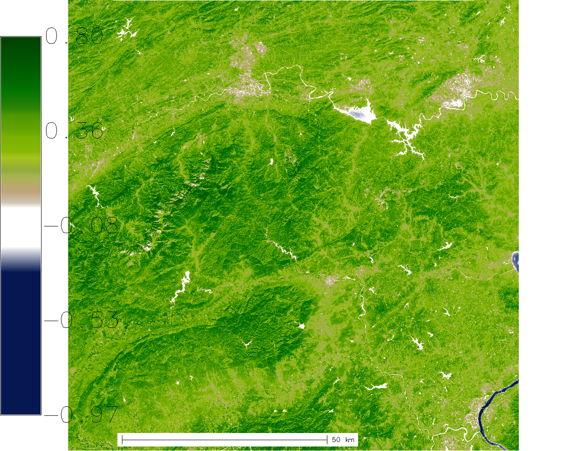

Sentinel-2 NDVI computation ===========================

The following asynchronous API call computes the NDVI of the Sentinel-2
scene
**S2A\_MSIL1C\_20161206T030112\_N0204\_R032\_T50RKR\_20161206T030749**:

```bash
 curl ${AUTH} -X POST "${ACTINIA_URL}/sentinel2_process/ndvi/S2A_MSIL1C_20161206T030112_N0204_R032_T50RKR_20161206T030749"
```

The response provides the status URL that must be polled to receive the
finished response:

```json
 {
   "accept_datetime": "2018-05-30 12:25:43.987713",
   "accept_timestamp": 1527683143.9877105,
   "api_info": {
     "endpoint": "asyncephemeralsentinel2processingresource",
     "method": "POST",
     "path": "/api/v1/sentinel2_process/ndvi/S2A_MSIL1C_20161206T030112_N0204_R032_T50RKR_20161206T030749",
     "request_url": "http://actinia.mundialis.de/api/v1/sentinel2_process/ndvi/S2A_MSIL1C_20161206T030112_N0204_R032_T50RKR_20161206T030749"
   },
   "datetime": "2018-05-30 12:25:43.989044",
   "http_code": 200,
   "message": "Resource accepted",
   "process_chain_list": [],
   "process_results": {},
   "resource_id": "resource_id-6b849585-576f-40b5-a514-34a7cf1f97ce",
   "status": "accepted",
   "time_delta": 0.001340627670288086,
   "timestamp": 1527683143.989044,
   "urls": {
     "resources": [],
     "status": "http://actinia.mundialis.de/api/v1/resources/superadmin/resource_id-6b849585-576f-40b5-a514-34a7cf1f97ce"
   },
   "user_id": "superadmin"
 }
```

Poll the status of the asynchronous API call by polling the status URL.
Be aware that the resource id will change for different NDVI API calls.

```bash
 curl ${AUTH} -X GET -i http://actinia.mundialis.de/api/v1/resources/superadmin/resource_id-6b849585-576f-40b5-a514-34a7cf1f97ce
```

The final result will contain a complete processing list as well as
URL\'s to the resulting PNG preview image, the created NDVI GeoTiff file
as well as univariate statistics of the computed NDVI scene.

```json
 {
   "accept_datetime": "2018-05-30 12:25:43.987713",
   "accept_timestamp": 1527683143.9877105,
   "api_info": {
     "endpoint": "asyncephemeralsentinel2processingresource",
     "method": "POST",
     "path": "/api/v1/sentinel2_process/ndvi/S2A_MSIL1C_20161206T030112_N0204_R032_T50RKR_20161206T030749",
     "request_url": "http://actinia.mundialis.de/api/v1/sentinel2_process/ndvi/S2A_MSIL1C_20161206T030112_N0204_R032_T50RKR_20161206T030749"
   },
   "datetime": "2018-05-30 12:29:11.800608",
   "http_code": 200,
   "message": "Processing successfully finished",
   "process_chain_list": [
     {
       "1": {
         "flags": "g",
         "inputs": {
           "map": "ndvi"
         },
         "module": "r.univar",
         "outputs": {
           "output": {
             "name": "/actinia/workspace/temp_db/gisdbase_103a050c380e4f50b36efd3f77bd1419/.tmp/tmp7il3n0jk.univar"
           }
         }
       }
     },
     {
       "1": {
         "inputs": {
           "map": "ndvi"
         },
         "module": "d.rast"
       },
       "2": {
         "flags": "n",
         "inputs": {
           "at": "8,92,0,7",
           "raster": "ndvi"
         },
         "module": "d.legend"
       },
       "3": {
         "inputs": {
           "at": "20,4",
           "style": "line"
         },
         "module": "d.barscale"
       }
     }
   ],
   "process_log": [
     {
       "executable": "/usr/bin/wget",
       "parameter": [
         "-t5",
         "-c",
         "-q",
         "https://storage.googleapis.com/gcp-public-data-sentinel-2/tiles/50/R/KR/S2A_MSIL1C_20161206T030112_N0204_R032_T50RKR_20161206T030749.SAFE/GRANULE/L1C_T50RKR_A007608_20161206T030749/IMG_DATA/T50RKR_20161206T030112_B08.jp2"
       ],
       "return_code": 0,
       "run_time": 49.85953092575073,
       "stderr": [
         ""
       ],
       "stdout": ""
     },
     {
       "executable": "/usr/bin/wget",
       "parameter": [
         "-t5",
         "-c",
         "-q",
         "https://storage.googleapis.com/gcp-public-data-sentinel-2/tiles/50/R/KR/S2A_MSIL1C_20161206T030112_N0204_R032_T50RKR_20161206T030749.SAFE/GRANULE/L1C_T50RKR_A007608_20161206T030749/IMG_DATA/T50RKR_20161206T030112_B04.jp2"
       ],
       "return_code": 0,
       "run_time": 38.676433801651,
       "stderr": [
         ""
       ],
       "stdout": ""
     },
     {
       "executable": "/bin/mv",
       "parameter": [
         "/actinia/workspace/temp_db/gisdbase_103a050c380e4f50b36efd3f77bd1419/.tmp/S2A_MSIL1C_20161206T030112_N0204_R032_T50RKR_20161206T030749.gml",
         "/actinia/workspace/download_cache/superadmin/S2A_MSIL1C_20161206T030112_N0204_R032_T50RKR_20161206T030749.gml"
       ],
       "return_code": 0,
       "run_time": 0.05118393898010254,
       "stderr": [
         ""
       ],
       "stdout": ""
     },
     {
       "executable": "/bin/mv",
       "parameter": [
         "/actinia/workspace/temp_db/gisdbase_103a050c380e4f50b36efd3f77bd1419/.tmp/T50RKR_20161206T030112_B08.jp2",
         "/actinia/workspace/download_cache/superadmin/S2A_MSIL1C_20161206T030112_N0204_R032_T50RKR_20161206T030749_B08"
       ],
       "return_code": 0,
       "run_time": 0.35857558250427246,
       "stderr": [
         ""
       ],
       "stdout": ""
     },
     {
       "executable": "/bin/mv",
       "parameter": [
         "/actinia/workspace/temp_db/gisdbase_103a050c380e4f50b36efd3f77bd1419/.tmp/T50RKR_20161206T030112_B04.jp2",
         "/actinia/workspace/download_cache/superadmin/S2A_MSIL1C_20161206T030112_N0204_R032_T50RKR_20161206T030749_B04"
       ],
       "return_code": 0,
       "run_time": 0.15271401405334473,
       "stderr": [
         ""
       ],
       "stdout": ""
     },
     {
       "executable": "python3",
       "parameter": [
         "/usr/local/bin/grass78",
         "-e",
         "-c",
         "/actinia/workspace/download_cache/superadmin/S2A_MSIL1C_20161206T030112_N0204_R032_T50RKR_20161206T030749_B08",
         "/actinia/workspace/temp_db/gisdbase_103a050c380e4f50b36efd3f77bd1419/sentinel2"
       ],
       "return_code": 0,
       "run_time": 0.36118006706237793,
       "stderr": [
         "Default locale settings are missing. GRASS running with C locale.WARNING: Searched for a web browser, but none found",
         "Creating new GRASS GIS location/mapset...",
         "Cleaning up temporary files...",
         ""
       ],
       "stdout": "Default locale not found, using UTF-8\n"
     },
     {
       "executable": "v.import",
       "parameter": [
         "input=/actinia/workspace/download_cache/superadmin/S2A_MSIL1C_20161206T030112_N0204_R032_T50RKR_20161206T030749.gml",
         "output=S2A_MSIL1C_20161206T030112_N0204_R032_T50RKR_20161206T030749",
         "--q"
       ],
       "return_code": 0,
       "run_time": 0.3551313877105713,
       "stderr": [
         "WARNING: Projection of dataset does not appear to match current location.",
         "",
         "Location PROJ_INFO is:",
         "name: WGS 84 / UTM zone 50N",
         "datum: wgs84",
         "ellps: wgs84",
         "proj: utm",
         "zone: 50",
         "no_defs: defined",
         "",
         "Dataset PROJ_INFO is:",
         "name: WGS 84",
         "datum: wgs84",
         "ellps: wgs84",
         "proj: ll",
         "no_defs: defined",
         "",
         "ERROR: proj",
         "",
         "WARNING: Width for column fid set to 255 (was not specified by OGR), some strings may be truncated!",
         ""
       ],
       "stdout": ""
     },
     {
       "executable": "v.timestamp",
       "parameter": [
         "map=S2A_MSIL1C_20161206T030112_N0204_R032_T50RKR_20161206T030749",
         "date=06 dec 2016 03:07:49"
       ],
       "return_code": 0,
       "run_time": 0.050455570220947266,
       "stderr": [
         ""
       ],
       "stdout": ""
     },
     {
       "executable": "/usr/bin/gdal_translate",
       "parameter": [
         "-projwin",
         "113.949663",
         "28.011816",
         "115.082607",
         "27.001706",
         "-of",
         "vrt",
         "-projwin_srs",
         "EPSG:4326",
         "/actinia/workspace/download_cache/superadmin/S2A_MSIL1C_20161206T030112_N0204_R032_T50RKR_20161206T030749_B08",
         "/actinia/workspace/download_cache/superadmin/S2A_MSIL1C_20161206T030112_N0204_R032_T50RKR_20161206T030749_B08.vrt"
       ],
       "return_code": 0,
       "run_time": 0.05114293098449707,
       "stderr": [
         "Warning 1: Computed -srcwin 5 -225 10971 11419 falls partially outside raster extent. Going on however.",
         ""
       ],
       "stdout": "Input file size is 10980, 10980\n"
     },
     {
       "executable": "r.import",
       "parameter": [
         "input=/actinia/workspace/download_cache/superadmin/S2A_MSIL1C_20161206T030112_N0204_R032_T50RKR_20161206T030749_B08.vrt",
         "output=S2A_MSIL1C_20161206T030112_N0204_R032_T50RKR_20161206T030749_B08_uncropped",
         "--q"
       ],
       "return_code": 0,
       "run_time": 16.326167583465576,
       "stderr": [
         ""
       ],
       "stdout": ""
     },
     {
       "executable": "g.region",
       "parameter": [
         "align=S2A_MSIL1C_20161206T030112_N0204_R032_T50RKR_20161206T030749_B08_uncropped",
         "vector=S2A_MSIL1C_20161206T030112_N0204_R032_T50RKR_20161206T030749",
         "-g"
       ],
       "return_code": 0,
       "run_time": 0.10460591316223145,
       "stderr": [
         ""
       ],
       "stdout": "projection=1\nzone=50\nn=3100030\ns=2990100\nw=199960\ne=309790\nnsres=10\newres=10\nrows=10993\ncols=10983\ncells=120736119\n"
     },
     {
       "executable": "r.mask",
       "parameter": [
         "vector=S2A_MSIL1C_20161206T030112_N0204_R032_T50RKR_20161206T030749"
       ],
       "return_code": 0,
       "run_time": 7.36047887802124,
       "stderr": [
         "Reading areas...",
         "0..100",
         "Writing raster map...",
         "0..3..6..9..12..15..18..21..24..27..30..33..36..39..42..45..48..51..54..57..60..63..66..69..72..75..78..81..84..87..90..93..96..99..100",
         "Reading areas...",
         "0..100",
         "Writing raster map...",
         "0..3..6..9..12..15..18..21..24..27..30..33..36..39..42..45..48..51..54..57..60..63..66..69..72..75..78..81..84..87..90..93..96..99..100",
         "All subsequent raster operations will be limited to the MASK area. Removing or renaming raster map named 'MASK' will restore raster operations to normal.",
         ""
       ],
       "stdout": ""
     },
     {
       "executable": "r.mapcalc",
       "parameter": [
         "expression=S2A_MSIL1C_20161206T030112_N0204_R032_T50RKR_20161206T030749_B08 = float(S2A_MSIL1C_20161206T030112_N0204_R032_T50RKR_20161206T030749_B08_uncropped)"
       ],
       "return_code": 0,
       "run_time": 10.695591926574707,
       "stderr": [
         ""
       ],
       "stdout": ""
     },
     {
       "executable": "r.timestamp",
       "parameter": [
         "map=S2A_MSIL1C_20161206T030112_N0204_R032_T50RKR_20161206T030749_B08",
         "date=06 dec 2016 03:07:49"
       ],
       "return_code": 0,
       "run_time": 0.053069353103637695,
       "stderr": [
         ""
       ],
       "stdout": ""
     },
     {
       "executable": "g.remove",
       "parameter": [
         "type=raster",
         "name=S2A_MSIL1C_20161206T030112_N0204_R032_T50RKR_20161206T030749_B08_uncropped",
         "-f"
       ],
       "return_code": 0,
       "run_time": 0.050362348556518555,
       "stderr": [
         "Removing raster <S2A_MSIL1C_20161206T030112_N0204_R032_T50RKR_20161206T030749_B08_uncropped>",
         ""
       ],
       "stdout": ""
     },
     {
       "executable": "r.mask",
       "parameter": [
         "-r"
       ],
       "return_code": 0,
       "run_time": 0.10059237480163574,
       "stderr": [
         "Raster MASK removed",
         ""
       ],
       "stdout": ""
     },
     {
       "executable": "/usr/bin/gdal_translate",
       "parameter": [
         "-projwin",
         "113.949663",
         "28.011816",
         "115.082607",
         "27.001706",
         "-of",
         "vrt",
         "-projwin_srs",
         "EPSG:4326",
         "/actinia/workspace/download_cache/superadmin/S2A_MSIL1C_20161206T030112_N0204_R032_T50RKR_20161206T030749_B04",
         "/actinia/workspace/download_cache/superadmin/S2A_MSIL1C_20161206T030112_N0204_R032_T50RKR_20161206T030749_B04.vrt"
       ],
       "return_code": 0,
       "run_time": 0.05096769332885742,
       "stderr": [
         "Warning 1: Computed -srcwin 5 -225 10971 11419 falls partially outside raster extent. Going on however.",
         ""
       ],
       "stdout": "Input file size is 10980, 10980\n"
     },
     {
       "executable": "r.import",
       "parameter": [
         "input=/actinia/workspace/download_cache/superadmin/S2A_MSIL1C_20161206T030112_N0204_R032_T50RKR_20161206T030749_B04.vrt",
         "output=S2A_MSIL1C_20161206T030112_N0204_R032_T50RKR_20161206T030749_B04_uncropped",
         "--q"
       ],
       "return_code": 0,
       "run_time": 16.76022958755493,
       "stderr": [
         ""
       ],
       "stdout": ""
     },
     {
       "executable": "g.region",
       "parameter": [
         "align=S2A_MSIL1C_20161206T030112_N0204_R032_T50RKR_20161206T030749_B04_uncropped",
         "vector=S2A_MSIL1C_20161206T030112_N0204_R032_T50RKR_20161206T030749",
         "-g"
       ],
       "return_code": 0,
       "run_time": 0.0505826473236084,
       "stderr": [
         ""
       ],
       "stdout": "projection=1\nzone=50\nn=3100030\ns=2990100\nw=199960\ne=309790\nnsres=10\newres=10\nrows=10993\ncols=10983\ncells=120736119\n"
     },
     {
       "executable": "r.mask",
       "parameter": [
         "vector=S2A_MSIL1C_20161206T030112_N0204_R032_T50RKR_20161206T030749"
       ],
       "return_code": 0,
       "run_time": 6.779608249664307,
       "stderr": [
         "Reading areas...",
         "0..100",
         "Writing raster map...",
         "0..3..6..9..12..15..18..21..24..27..30..33..36..39..42..45..48..51..54..57..60..63..66..69..72..75..78..81..84..87..90..93..96..99..100",
         "Reading areas...",
         "0..100",
         "Writing raster map...",
         "0..3..6..9..12..15..18..21..24..27..30..33..36..39..42..45..48..51..54..57..60..63..66..69..72..75..78..81..84..87..90..93..96..99..100",
         "All subsequent raster operations will be limited to the MASK area. Removing or renaming raster map named 'MASK' will restore raster operations to normal.",
         ""
       ],
       "stdout": ""
     },
     {
       "executable": "r.mapcalc",
       "parameter": [
         "expression=S2A_MSIL1C_20161206T030112_N0204_R032_T50RKR_20161206T030749_B04 = float(S2A_MSIL1C_20161206T030112_N0204_R032_T50RKR_20161206T030749_B04_uncropped)"
       ],
       "return_code": 0,
       "run_time": 10.141529321670532,
       "stderr": [
         ""
       ],
       "stdout": ""
     },
     {
       "executable": "r.timestamp",
       "parameter": [
         "map=S2A_MSIL1C_20161206T030112_N0204_R032_T50RKR_20161206T030749_B04",
         "date=06 dec 2016 03:07:49"
       ],
       "return_code": 0,
       "run_time": 0.05050253868103027,
       "stderr": [
         ""
       ],
       "stdout": ""
     },
     {
       "executable": "g.remove",
       "parameter": [
         "type=raster",
         "name=S2A_MSIL1C_20161206T030112_N0204_R032_T50RKR_20161206T030749_B04_uncropped",
         "-f"
       ],
       "return_code": 0,
       "run_time": 0.05098080635070801,
       "stderr": [
         "Removing raster <S2A_MSIL1C_20161206T030112_N0204_R032_T50RKR_20161206T030749_B04_uncropped>",
         ""
       ],
       "stdout": ""
     },
     {
       "executable": "r.mask",
       "parameter": [
         "-r"
       ],
       "return_code": 0,
       "run_time": 0.10424232482910156,
       "stderr": [
         "Raster MASK removed",
         ""
       ],
       "stdout": ""
     },
     {
       "executable": "r.mapcalc",
       "parameter": [
         "expression=ndvi = (float(S2A_MSIL1C_20161206T030112_N0204_R032_T50RKR_20161206T030749_B08) - float(S2A_MSIL1C_20161206T030112_N0204_R032_T50RKR_20161206T030749_B04))/(float(S2A_MSIL1C_20161206T030112_N0204_R032_T50RKR_20161206T030749_B08) + float(S2A_MSIL1C_20161206T030112_N0204_R032_T50RKR_20161206T030749_B04))"
       ],
       "return_code": 0,
       "run_time": 20.28681755065918,
       "stderr": [
         ""
       ],
       "stdout": ""
     },
     {
       "executable": "r.colors",
       "parameter": [
         "color=ndvi",
         "map=ndvi"
       ],
       "return_code": 0,
       "run_time": 0.05031251907348633,
       "stderr": [
         "Color table for raster map <ndvi> set to 'ndvi'",
         ""
       ],
       "stdout": ""
     },
     {
       "executable": "r.univar",
       "parameter": [
         "map=ndvi",
         "output=/actinia/workspace/temp_db/gisdbase_103a050c380e4f50b36efd3f77bd1419/.tmp/tmp7il3n0jk.univar",
         "-g"
       ],
       "return_code": 0,
       "run_time": 4.54892897605896,
       "stderr": [
         ""
       ],
       "stdout": ""
     },
     {
       "executable": "d.rast",
       "parameter": [
         "map=ndvi"
       ],
       "return_code": 0,
       "run_time": 2.0198700428009033,
       "stderr": [
         "0..3..6..9..12..15..18..21..24..27..30..33..36..39..42..45..48..51..54..57..60..63..66..69..72..75..78..81..84..87..90..93..96..99..100",
         ""
       ],
       "stdout": ""
     },
     {
       "executable": "d.legend",
       "parameter": [
         "raster=ndvi",
         "at=8,92,0,7",
         "-n"
       ],
       "return_code": 0,
       "run_time": 0.4614551067352295,
       "stderr": [
         ""
       ],
       "stdout": ""
     },
     {
       "executable": "d.barscale",
       "parameter": [
         "style=line",
         "at=20,4"
       ],
       "return_code": 0,
       "run_time": 0.416748046875,
       "stderr": [
         ""
       ],
       "stdout": ""
     },
     {
       "executable": "g.region",
       "parameter": [
         "raster=ndvi",
         "-g"
       ],
       "return_code": 0,
       "run_time": 0.051720619201660156,
       "stderr": [
         ""
       ],
       "stdout": "projection=1\nzone=50\nn=3100030\ns=2990100\nw=199960\ne=309790\nnsres=10\newres=10\nrows=10993\ncols=10983\ncells=120736119\n"
     },
     {
       "executable": "r.out.gdal",
       "parameter": [
         "-fm",
         "input=ndvi",
         "format=GTiff",
         "createopt=COMPRESS=LZW",
         "output=/actinia/workspace/temp_db/gisdbase_103a050c380e4f50b36efd3f77bd1419/.tmp/ndvi.tiff"
       ],
       "return_code": 0,
       "run_time": 12.550397157669067,
       "stderr": [
         "Checking GDAL data type and nodata value...",
         "2..5..8..11..14..17..20..23..26..29..32..35..38..41..44..47..50..53..56..59..62..65..68..71..74..77..80..83..86..89..92..95..98..100",
         "Using GDAL data type <Float32>",
         "Input raster map contains cells with NULL-value (no-data). The value -nan will be used to represent no-data values in the input map. You can specify a nodata value with the nodata option.",
         "Exporting raster data to GTiff format...",
         "ERROR 6: SetColorTable() only supported for Byte or UInt16 bands in TIFF format.",
         "2..5..8..11..14..17..20..23..26..29..32..35..38..41..44..47..50..53..56..59..62..65..68..71..74..77..80..83..86..89..92..95..98..100",
         "r.out.gdal complete. File </actinia/workspace/temp_db/gisdbase_103a050c380e4f50b36efd3f77bd1419/.tmp/ndvi.tiff> created.",
         ""
       ],
       "stdout": ""
     }
   ],
   "process_results": [
     {
       "cells": 120736119.0,
       "coeff_var": 39.2111992829072,
       "max": 0.80298912525177,
       "mean": 0.345280366103636,
       "mean_of_abs": 0.347984182813063,
       "min": -0.96863466501236,
       "n": 120371030.0,
       "name": "ndvi",
       "null_cells": 365089.0,
       "range": 1.77162379026413,
       "stddev": 0.135388572437648,
       "sum": 41561753.3066718,
       "variance": 0.0183300655467043
     }
   ],
   "progress": {
     "num_of_steps": 33,
     "step": 32
   },
   "resource_id": "resource_id-6b849585-576f-40b5-a514-34a7cf1f97ce",
   "status": "finished",
   "time_delta": 207.813636302948,
   "timestamp": 1527683351.8002071,
   "urls": {
     "resources": [
       "http://actinia.mundialis.de/api/v1/resource/superadmin/resource_id-6b849585-576f-40b5-a514-34a7cf1f97ce/tmpsaeegg0q.png",
       "http://actinia.mundialis.de/api/v1/resource/superadmin/resource_id-6b849585-576f-40b5-a514-34a7cf1f97ce/ndvi.tiff"
     ],
     "status": "http://actinia.mundialis.de/api/v1/resources/superadmin/resource_id-6b849585-576f-40b5-a514-34a7cf1f97ce"
   },
   "user_id": "superadmin"
 }
```

The following URL\'s point to the resulting PNG preview image and the
NDVI GeoTiff file:

 <http://actinia.mundialis.de/api/v1/resource/superadmin/resource_id-6b849585-576f-40b5-a514-34a7cf1f97ce/tmpsaeegg0q.png>
 <http://actinia.mundialis.de/api/v1/resource/superadmin/resource_id-6b849585-576f-40b5-a514-34a7cf1f97ce/ndvi.tiff>

The PNG preview should look like this:

 
